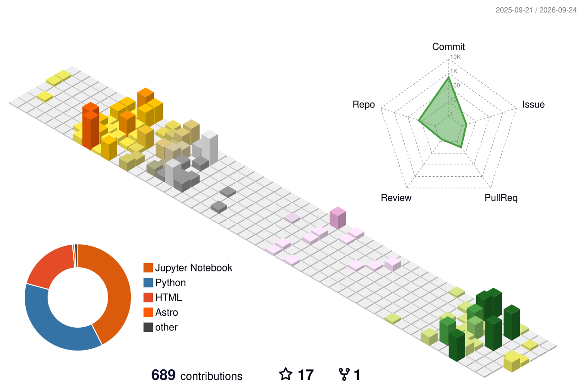

# Isaac Yong (용이삭)

**Physicist building the software layer of X-ray experiments.**

MS student in Physics at Sogang University (CUPT Lab). I work across X-ray
reflectivity (XRR), diffraction (XRD), and coherent / Bragg X-ray diffraction at
synchrotron and XFEL facilities — and I write the tooling that turns raw beamtime
data into results: differentiable physics simulators, machine-learning models for
inverse problems, reproducible analysis pipelines, and calculators that run on the
machines actually sitting in the hutch.

---

## Research Focus

- **X-ray reflectivity & thin-film structure** — solving the XRR inverse problem
  (thickness, roughness, SLD) with differentiable Abeles transfer-matrix
  simulation, neural surrogates, and gradient-based physics refinement.
- **Coherent diffraction & XFEL data** — time-resolved pipelines for PAL-XFEL
  experiments, plus strain, twin-domain, and 3D volume analysis for coherent
  X-ray diffraction data.
- **Beamline computation & reproducibility** — X-ray optics and beamline
  calculators, SPEC/HDF5 data handling, and `uv`-locked, config-driven Python
  pipelines built so a result can be regenerated later.

---

## Selected Projects

**[ReflectoLearn](https://github.com/SJB7777/ReflectoLearn)** — XRR inverse
modeling with a differentiable Abeles engine and a 1D CNN. Training curves are
simulated on the fly with realistic instrument effects (Poisson noise,
resolution smearing, beam footprint, background), and the network prediction can
be refined by gradient descent back through the same physics engine.

**[CordaX](https://github.com/SJB7777/CordaX)** — A toolkit for time-resolved
ultrafast X-ray experiments, tailored to data from **PAL-XFEL**. Config-driven
runs, logging, and reproducible analysis outputs. Refactored from and credited to
the legacy `XFEL_data` system.

**[Beamline Toolkit](https://github.com/SJB7777/xray)** —
[xray.ooguy.com](https://xray.ooguy.com) · A browser-based toolkit for beamline
work: energy–wavelength and Bragg calculations, grating dispersion, complex
refractive index and attenuation, Q-space conversion, beam footprint, photon
flux, monochromator resolution, CDI/BCDI oversampling checks, plus an electronic
logbook and experiment manager. Written in dependency-free vanilla JavaScript so
it runs offline on legacy beamline browsers.

**[roi_rectangle](https://github.com/SJB7777/roi_rectangle)** — A small, tested,
[PyPI-published](https://pypi.org/project/roi-rectangle/) Python package for
rectangular regions of interest in detector images. Used across my own
diffraction analysis code.

**[codigest](https://github.com/SJB7777/codigest)** — A read-only CLI that
extracts and structures codebase context for LLMs, tracking work-in-progress
changes through a shadow-Git anchor without touching your real history.

---

## Technical Focus

**Physics & methods** · XRR · XRD · Coherent / Bragg X-ray diffraction · X-ray
optics · Abeles transfer-matrix modeling · rocking curves · strain analysis

**Scientific Python** · NumPy · SciPy · pandas · h5py · Matplotlib · PyVista ·
napari · scikit-learn · scikit-image

**Machine learning** · PyTorch · differentiable physics · JAX · Gymnasium /
Stable-Baselines3

**Tooling & delivery** · Python 3.13+ · `uv` · packaging & PyPI · GitHub Actions
· pytest · Dash · Next.js / TypeScript · vanilla JS

---

## Elsewhere

- 🌐 Website — [xray.ooguy.com](https://xray.ooguy.com)
- ✉️ Email — [isaacyong@naver.com](mailto:isaacyong@naver.com)
- 📝 Blog — [SJB7777.github.io](https://sjb7777.github.io)
- 🎓 ORCID — <!-- add ORCID URL -->
- 📄 Google Scholar — <!-- add Scholar URL -->
- 💼 LinkedIn — <!-- add LinkedIn URL -->

Open to collaboration on X-ray analysis methods, scientific software, and
reproducible experimental pipelines.
